# Short

Update that add a new surface called Gaia that is accessible from midgame. Add more story to Artifacts and alien leftovers, overhaul EI endgame. Lots of balancing that is needed and simultaneous release with `EI: Magnet trains`.

# Overall changes

- no more phasing out of low tier science packs
- a lot of techs are still missing proper prerequisites
- reorganising of infinite techs to make more sense

# Additional surface Gaia

New surface, that is only accessible through a gate when steering a drone
and starts in computer age, gaia resources are needed for new sub computer age called knowledge computer age and later.

Changed ressources:
1. No base ressources:
    - on gaia no iron, copper, coal, lead, uranium, neodym can be found
    - oil and sulfur and patches are more common
    - additionally patches for dirty water, ammonia, coal gas can be found

3 new resources:
1. Cryoflux: 
    - "water" for alien plants, also will get 3 levels of purity so one needs to purify to get better flowers, all of these recipes will have quite a lot of backloops and refeeding and percentage chances
    - can be turned into crystalised form -> cryodust
    - cryodust can be used in semiconductor production to make it more eff
    - condensed cryodust will allow to grow a tier 3 energy crystal by using high energy crystal (needed in late game)
    - condensed cryodust will be needed in more lategame stuff aswell
    - on Gaia nuclear does not work -> only power by solar / coal (maybe nerf these here?) or by alien artifacts that run on cryodust / cryoflux (first one more energetic)
2. Phytogas:
    - need acidic water for drilling
    - alien flowers can now only be grown on Gaia in bio chamber and new bio reactor
    - 3 total tiers of alien flowers (2 in computer age, 1 later)
    - tier 1 is used in knowledge science and for blue belts
    - tier 2 is used in prod modules tier 3 and part of new recipe for computing unit to gate quantum age
    - tier 3 will be used only later on for odd plating and the high tech bio stuff
    - tier 2 is used in suspicious plating (pre to odd plating) for various machine upgrades such as in advanced motor
    - also maybe add a way to get more of low tier science packs when using tier 2 / 3 alien resin
    - phytogas can be used to improve yield of some crystal growing recipes / energy crystal solution
3. Utopium: end game material that has 2 grades of purity, can be used to gain additional products out of crafting processes (intermediates need grade 1) and science and other special appl. need grade 2 (maybe rethink this as its kinda out of place, also looking at exotic matter that needs rethinking)

Difficulties:
1. Terrain and Water level are difficult
2. Nuclear power such as Fission and Fusion does NOT work (via script, think of a reason like in the expanse) -> need for solar/burn stuff or use alien flux generators for power, add alien crystal generators that just make power (but need condensed cryodust infused crystal to "activate", maybe also find working one on nauvis or possiblity to get crystal and off version)
3. no biters
4. no direct water, only over secondary from gaia pump (treat air filter recipe for water accordingly)
5. no main ressources, only over dirty water

# alien knowledge system

Scanning of alien artifacts f.e. on nauvis allows collection of knowledge, mainly focused on finding ways to repair alien artifacts/replicated them and improving bots etc by buffs.
At first knowledge can only be obtained by hand via scanning of artifacts. The knowledge system should be separated into Tiers, each having some minor buffs and a major repair/building "tech" that can only be unlocked by having aquired knowledge about schematics.
Scanning a unknown artifacts yields more "knowledge" and if possible a random schematic for that artifact, scanning a known artifact reduces this chance to 5 / 10 %. Use informatron for UI of knowledge system.

Note here many things may still be missing:

Tier 1

Tier 2

Tier 3

```mermaid
flowchart TD
    A(more buffs)
    B(Schematic 1) --> G
    C(Schematic 2) --> G
    D(Schematic 3) --> G
    G(Repair kit for alien beacons)
    H(Schematic 4) --> I(Subdim energy cable)
    K(Schematic 5) --> M(Entangled chest)
    N(Schematic 6) --> O(Tunnel, just a invisble inserter of different lenghts and is very fast, moving stacks from A to B)
    P(Über Bio Armor, 16x16 Grid)
```

maybe include the black hole here? Or add a new win con based on the knowledge system,
like a new superstructure or a tech that needs to be aquired with huge amounts of knowledge

# alien related structures

Note that repaired/replicated versions may not be so OP as the working ones 

New artifacts:
1. Broken/working alien crystal generator: Produces power, one may find empty but working ones, inserting a energy crystal will then turn the device on, accordingly depending on the crystal tier more or less power out, does not cosume the crystal, way more effective on Gaia
2. Knowledge core: parts of a ancient alien computer brain, yield high knowledge when scanned, 3 - 5 schematics for different core variants: like Neurondatabase, Synaptic nexus, Holo interface, Knowledge matrix, Core linker
3. Utopium enricher: Improve yield of utopium processing with this
4. Uranium enricher: Bring back Kovarex in a more complex form
5. "Far"station: Substation with incredible range

building all parts allows crafting of the knowledge core, basically an item void that can turn science packs into a constant generation of knowledge, needing power and cooling and supply of electronic parts

Maybe code as a assembler, similar to rocket silo/fusion reactor and allow to have different recipes that generate knowledge corresponding to the "price" of items put in, better of these recipes could be aquired by knowledge system
3. Broken gate ring parts: exactly 3 parts of a broken gate can be found on nauvis at set positions, allowing to build the alien gate in tier 1 

# rework of rocket system

Atm rockets are to repetetive, maybe make some destinations only accessibile from gaia?
Make asteriod mining more viable or remove it, with utopium it kinda becomes useless, or dont add utopium? This needes some work

# remake exotic matter

include utopium as some sort of catalist in swaping the states of exotic matter

# Restructuring of computer age

lithium on gaia.