New main content:

# additional surface Gaia

New surface, that is only accessible through a gate when steering a drone
and starts in computer age, gaia resources are needed for advanced computer age and later

3 new resources:
1. Cryoflux: used to grow alien crystals after high energy crystal, power sources on gaia and for repairing alien structures
2. Phytogas: used to grow alien flowers, odd plating will be available earlier and very odd plating and other variations will get added
3. Utopium: end game material that has 2 grades of purity, can be used to gain additional products out of crafting processes (intermediates need grade 1) and science and other special appl. need grade 2

Difficulties:
1. Terrain and Water level are difficult
2. Nuclear power such as Fission and Fusion does NOT work (via script, think of a reason like in the expanse) -> need for solar/burn stuff or use alien energy crystal generators for power (they are way more effective on Gaia then on Nauvis as crystals radiate more energy there)
3. no biters

# alien knowledge system

Scanning of alien artifacts f.e. on nauvis allows collection of knowledge, mainly focused on finding ways to repair alien artifacts/replicated them and improving bots etc by buffs.
At first knowledge can only be obtained by hand via scanning of artifacts. The knowledge system should be separated into Tiers, each having some minor buffs and a major repair/building "tech" that can only be unlocked by having aquired knowledge about schematics.
Scanning a unknown artifacts yields more "knowledge" and if possible a random schematic for that artifact, scanning a known artifact reduces this chance to 5 / 10 %. Use informatron for UI of knowledge system.

Note here many things may still be missing:

Tier 1

Tier 2

Tier 3

```mermaid
flowchart TD
    A(more buffs)
    B(Schematic 1) --> G
    C(Schematic 2) --> G
    D(Schematic 3) --> G
    G(Repair kit for alien beacons)
    H(Schematic 4) --> I(Subdim energy cable)
    K(Schematic 5) --> M(Entangled chest)
    N(Schematic 6) --> O(Tunnel, just a invisble inserter of different lenghts and is very fast, moving stacks from A to B)
    P(Über Bio Armor, 16x16 Grid)
```

maybe include the black hole here? Or add a new win con based on the knowledge system,
like a new superstructure or a tech that needs to be aquired with huge amounts of knowledge

# alien related structures

Note that repaired/replicated versions may not be so OP as the working ones 

New artifacts:
1. Broken/working alien crystal generator: Produces power, one may find empty but working ones, inserting a energy crystal will then turn the device on, accordingly depending on the crystal tier more or less power out, does not cosume the crystal, way more effective on Gaia
2. Knowledge core: parts of a ancient alien computer brain, yield high knowledge when scanned, 3 - 5 schematics for different core variants: like Neurondatabase, Synaptic nexus, Holo interface, Knowledge matrix, Core linker
3. Utopium enricher: Improve yield of utopium processing with this
4. Uranium enricher: Bring back Kovarex in a more complex form
5. "Far"station: Substation with incredible range

building all parts allows crafting of the knowledge core, basically an item void that can turn science packs into a constant generation of knowledge, needing power and cooling and supply of electronic parts

Maybe code as a assembler, similar to rocket silo/fusion reactor and allow to have different recipes that generate knowledge corresponding to the "price" of items put in, better of these recipes could be aquired by knowledge system
3. Broken gate ring parts: exactly 3 parts of a broken gate can be found on nauvis at set positions, allowing to build the alien gate in tier 1 

# rework of rocket system

Atm rockets are to repetetive, maybe make some destinations only accessibile from gaia?
Make asteriod mining more viable or remove it, with utopium it kinda becomes useless, or dont add utopium? This needes some work

# remake exotic matter
